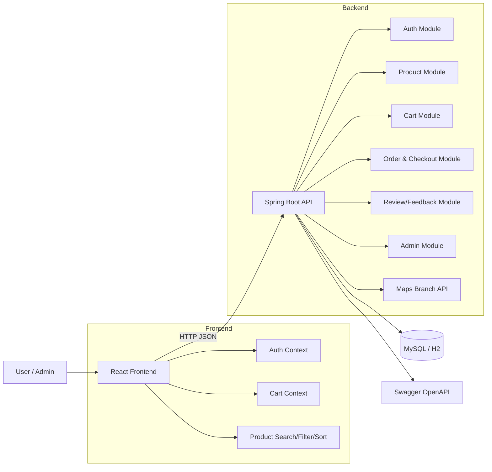

# Eyecare Glass - System Design

## 1. Kiến trúc tổng thể

Hệ thống hiện tại triển khai theo **Monolith MVC** (React SPA + Spring Boot API + MySQL/H2), đủ nhanh để team phát triển theo module:

- Frontend (UI/UX + logic client): React + Context API
- Backend core business: Spring Boot REST
- Data layer: JPA/Hibernate
- AuthN/AuthZ: JWT + Role (`USER`, `ADMIN`)
- API docs: Swagger/OpenAPI (`/api/swagger-ui.html`)

## 2. System Diagram

## 3. Mapping với phân công team

- Leader/System Architect: architecture + API contract + review
- Frontend 1: layout, responsive, component
- Frontend 2: API integration, search/filter/sort, cart sync
- Backend 1: auth/user/JWT/role
- Backend 2: product/cart/order/checkout/discount
- DB + Admin + Maps: schema, admin endpoint, map branches endpoint
- QA + Docs: feedback/review flow, policy content, test checklist
